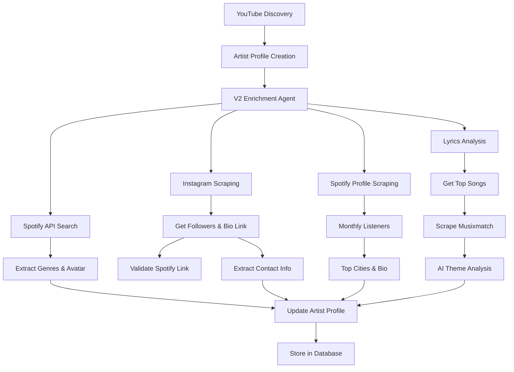

# Enhanced Enrichment V2 Documentation

## Overview

The Enhanced Enrichment V2 agent provides comprehensive artist data enrichment with advanced Firecrawl and Spotify integration, implementing the following key features:

## Key Features

### 1. **Spotify Artist Validation via Instagram**
- Searches artist's Instagram profile for Spotify links
- Validates Spotify artist identity by cross-referencing social media
- Extracts Spotify URLs from Instagram bio/links

### 2. **Spotify Profile Scraping**
The system scrapes the Spotify artist profile (`https://open.spotify.com/artist/{artist-id}`) to extract:
- **Monthly Listeners**: Current monthly listener count
- **Top Cities**: Geographic distribution of listeners
- **Artist Bio**: Detailed artist biography
- **Verification Status**: Whether the artist is verified on Spotify

### 3. **Instagram Profile Enrichment**
- **Follower Count**: Extracts current follower numbers
- **Link in Bio**: Captures the link in bio URL
- **Contact Discovery**: Searches link in bio destination for:
  - Email addresses (booking, management, general)
  - Phone numbers
  - Location information

### 4. **Lyrical Theme Analysis**
- Fetches artist's top songs from Spotify
- Scrapes lyrics from Musixmatch (`https://www.musixmatch.com/lyrics/{artist}/{song}`)
- AI-powered analysis to extract:
  - Main lyrical themes (3-5 themes)
  - Primary theme
  - Emotional tone
  - Subject matter categories

### 5. **Enhanced Spotify API Integration**
Using validated Spotify API calls:
- **Artist Genres**: Official genre classifications
- **Artist Avatar**: High-quality profile image URL
- **Follower Count**: Spotify follower statistics
- **Popularity Score**: Spotify's popularity metric

## Database Schema Updates

Two new columns have been added to the `artists` table:

```sql
-- Artist avatar URL
avatar_url TEXT

-- Lyrical themes array
lyrical_themes TEXT[]
```

## Usage

### Enable V2 Enrichment

The V2 enrichment is enabled by default. You can control it via the `USE_V2_ENRICHMENT` flag in `backend/app/api/routes.py`:

```python
# Global flag to control enrichment version
USE_V2_ENRICHMENT = True  # Set to False to use simple enrichment
```

### API Endpoints

All existing endpoints automatically use V2 enrichment when enabled:

- `POST /api/discover` - Standard discovery with V2 enrichment
- `POST /api/discover/undiscovered-talent` - Undiscovered talent discovery with V2 enrichment
- `GET /api/artists` - Returns artists with new fields (avatar_url, lyrical_themes)

### Data Flow



## Configuration Requirements

### Required API Keys

```env
# Spotify API (required for artist data)
SPOTIFY_CLIENT_ID=your_client_id
SPOTIFY_CLIENT_SECRET=your_client_secret

# Firecrawl API (required for web scraping)
FIRECRAWL_API_KEY=fc-your-api-key

# DeepSeek API (required for AI analysis)
DEEPSEEK_API_KEY=your_deepseek_key
```

### Firecrawl Configuration

The system uses Firecrawl for:
- Instagram profile scraping
- Spotify profile scraping
- Link in bio content extraction
- Lyrics page scraping

Ensure your Firecrawl API key has sufficient credits for these operations.

## Enrichment Score Calculation

The V2 enrichment score (0-1 scale) is calculated based on:

### Base Profile (40%)
- Artist name: 5%
- Spotify ID: 10%
- Instagram handle: 5%
- Email: 10%
- Genres: 5%
- Avatar URL: 5%

### Social Media Presence (20%)
- Spotify followers > 1000: 10%
- Instagram followers > 1000: 10%

### Enhanced Data (40%)
- Spotify validated: 10%
- Instagram enriched: 10%
- Spotify profile scraped: 10%
- Lyrics analyzed: 10%

## Example Response

When fetching an artist with V2 enrichment:

```json
{
  "id": "123e4567-e89b-12d3-a456-426614174000",
  "name": "Artist Name",
  "spotify_id": "3TVXtAsR1Inumwj472S9r4",
  "avatar_url": "https://i.scdn.co/image/avatar-url",
  "genres": ["indie rock", "alternative"],
  "lyrical_themes": ["love", "nostalgia", "personal growth"],
  "follower_counts": {
    "spotify": 125000,
    "instagram": 45000
  },
  "metadata": {
    "monthly_listeners": 89000,
    "top_cities": [
      {"city": "Los Angeles", "country": "US", "listeners": "12,345"},
      {"city": "London", "country": "UK", "listeners": "8,901"}
    ],
    "enrichment_v2": true,
    "validation_status": {
      "spotify_validated": true,
      "instagram_enriched": true,
      "lyrics_analyzed": true
    }
  },
  "enrichment_score": 0.85
}
```

## Error Handling

The V2 agent includes comprehensive error handling:
- Graceful fallback if any enrichment step fails
- Individual component failures don't block the entire enrichment
- Detailed error logging for debugging
- Partial enrichment is still saved

## Performance Considerations

- Instagram scraping: ~2-3 seconds per profile
- Spotify profile scraping: ~2-3 seconds per artist
- Lyrics scraping: ~1-2 seconds per song (max 3 songs)
- Total enrichment time: ~10-15 seconds per artist

## Monitoring

Check enrichment success via logs:
```
🎯 Starting comprehensive enrichment for Artist Name
✅ Spotify data retrieved for Artist Name
✅ Instagram profile scraped for Artist Name
✅ Spotify profile scraped: 89000 monthly listeners
✅ Scraped lyrics for Song Name
🎉 Comprehensive enrichment completed for Artist Name (score: 0.85)
```

## Troubleshooting

### Common Issues

1. **No Spotify data found**
   - Check if artist name matches Spotify exactly
   - Verify Spotify API credentials

2. **Instagram scraping fails**
   - Check if Instagram handle is correct
   - Verify Firecrawl API key and credits

3. **Lyrics not found**
   - Artist may not have lyrics on Musixmatch
   - Song titles may not match exactly

4. **Low enrichment scores**
   - Missing social media profiles
   - No email/contact information found
   - Failed validation steps

### Debug Mode

Enable detailed logging:
```python
import logging
logging.getLogger("app.agents.enhanced_enrichment_agent_v2").setLevel(logging.DEBUG)
``` 